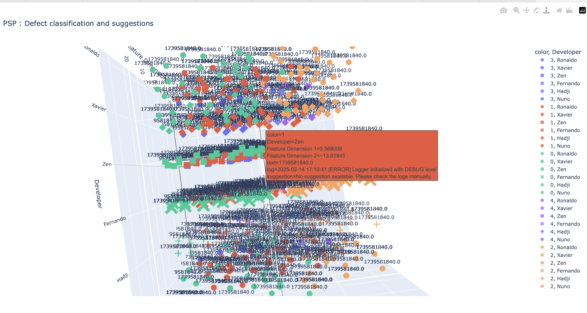

# PSP Defect Classification and Suggestion System

## Overview
The **PSP Defect Classification and Suggestion System** is an AI-driven tool designed for analyzing software defect logs. It processes log files from multiple developers, extracts meaningful insights using machine learning techniques, and provides automated suggestions for resolving common errors.

This system supports automated log processing, clustering of defects, and error suggestion through advanced AI models, providing developers with valuable insights into their code.

## Features
- **Automated Log Processing**: Reads log files from developer-specific directories.
- **Text Feature Extraction**: Uses TF-IDF vectorization to convert logs into numerical representations.
- **K-Means Clustering**: Groups logs into clusters to identify similar errors.
- **Dimensionality Reduction**: Applies UMAP for 2D visualization.
- **Error Suggestions**: Leverages Sentence Transformers and FAISS to provide solutions for common errors.
- **Interactive Visualization**: Uses Plotly to create a 3D scatter plot of clustered logs.
- **Real-Time Monitoring**: Monitors new log files and updates analysis periodically.

## Installation

### Prerequisites
Ensure you have the following dependencies installed:

```bash
pip install numpy pandas plotly umap-learn faiss-cpu tqdm scikit-learn sentence-transformers joblib
```

### Usage

#### Running the Log Processor
To start monitoring and processing logs, run the following command:

```bash
python log_analysis_offline.py
```

The script will continuously process logs and update the analysis every 10 seconds.

#### Log Directory Structure
Place log files under a directory structured as follows:

```
BASE_DIR/
├── Developer1/
│   ├── log1.log
│   ├── log2.log
├── Developer2/
│   ├── log1.log
│   ├── log2.log
```

Make sure to update the `BASE_DIR` constant in `log_analysis_offline.py` with the actual directory path where your log files are stored.

## How It Works
1. **Loading Logs**: Extracts log data from each developer’s directory.
2. **Feature Extraction**: Applies TF-IDF vectorization to convert the logs into numerical representations.
3. **Clustering**: Uses K-Means clustering to group similar logs together.
4. **Dimensionality Reduction**: Uses UMAP for reducing the dimensionality of the feature space for visualization.
5. **Error Suggestion**: Utilizes FAISS and Sentence Transformers to find relevant solutions for each error.
6. **Visualization**: Generates a 3D scatter plot for visualizing clustered logs.
7. **Real-Time Monitoring**: Continuously monitors new log files and updates the analysis.

## Example Output
- Logs are categorized into clusters like `NullPointerException`, `SyntaxError`, and more.
- Automated suggestions are provided for resolving identified issues.
- A 3D scatter plot is generated to allow interactive exploration of the clustered data.

### Example 3D Plot
Here’s an example of what the 3D plot might look like when visualizing the clustered logs:



## License
This project is open-source under the MIT License.

## Contributions
Feel free to submit issues or pull requests to improve the system.
